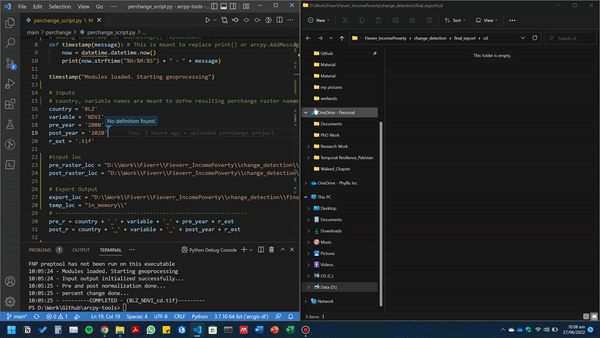
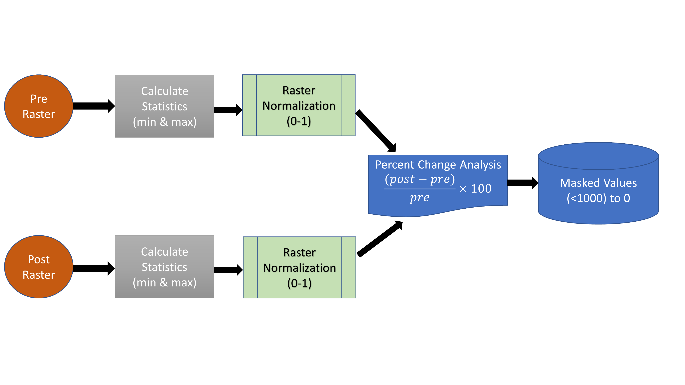

# The repository contains arcpy scripts, toolbox, and models compatible with ArcGIS Pro

## Hi, Welcome to this repo

Here you will find various arcpy based geoprocessing tools. The main purpose of designing these tools is to help in processing complex and multiple analysis in a single go.

## General  Instructions:
    
- To run any arcpy tool in IDE, first configure your IDE with ArcGIS Pro environment.

- To Run in ArcGIS Pro, open analysis tab, and then python option. Paste the script into console, or load the py extension file directly.

- To run model in ArcGIS Pro, in catalog add new folder connection. Then navigate to that folder in which you saved any tool with pyt extension. Open it, or with click on edit. On edit option, model builder will load up.

- ArcGIS Pro extention "Spatial Analyst" is requried for last step "Masking values greater then 1000"

Note: I am preparing Working instruction tutorials, and will link here when prepared. In case you need them earlier just email me.

## Current Projects:

## [1. PerChange](#1-perchange)

---

## **1. Perchange**

In ArcGIS pro, there is no specific tool to evaluate percent change for pre and post rasters (for non catagorical rasters only). Furthmore, when rasters have different range of data it is much difficult to evaluate percent change. All this can be solved using multiple raster calculator tools but what if we have to repeat the same task 100-200 times?

Keeping in mind this problem, I developed this short tool which works on the following methodology:

Thus it will take non-catagorical rasters as input (pre and post) and will give output as percent change.

- ArcPy Script of PerChange tool: [PerChange_Script.py](main/perchange/perchange_script.py)

- ArcGIS Pro Model for PerChange: [PerChange_Model](main/perchange/perchange_model.py)

- ArcPy Jupyter Notebook for PerChange: [PerChange_Notebook.ipynb](main/perchange/perchange_notebook.ipynb)
### Tool Specific Instructions

- Input pre and post rasters as non catagorical rasters only (not land use rasters)
- No need to define GeoDataBase & Workspace location
- Define variable, country, and year's name (only if you are using py ir ipynb script)
- Use Jupyter Notebook if you want to automate this task to all countries at once.

---

